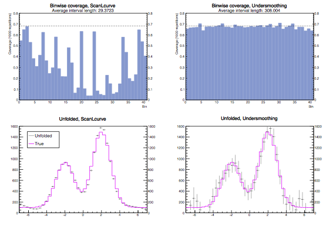

# Undersmoothed uncertainty quantification for unfolding    

### Authors: Junhyung Lyle Kim and Mikael Kuusela, University of Chicago

This repository provides an extension for the unfolding software [TUnfold V17.6](https://www.desy.de/~sschmitt/tunfold.html) written by Stefan Schmitt. TUnfold implements Tikhonov regularization for unfolding smeared data from particle detectors. However, as demonstrated by Kuusela (2016), the resulting confidence intervals may seriously underestimate the uncertainty in the unfolded space, unless care is taken in the choice of the regularization strength tau. This extension provides a new function for choosing the regularization strength, `UndersmoothTau`, which aims at choosing tau so that the confidence intervals have nearly nominal coverage. `UndersmoothTau` is an implementation of the data-driven undersmoothing technique introduced in Kuusela (2016). Please refer to the references section for more details on the statistical methodology.

## New functions

| Function | Input | Output | Description |
| --- | --- | --- | --- |
| `UndersmoothTau` | Initial tau, tolerance epsilon, max number of iterations | Undersmoothed tau | Undersmooths the initial tau (from L-curve for example) gradually until the minimum estimated coverage meets the target coverage, which is the nominal 68% minus the tolerance epsilon. This is the main function from the user's perspective. |
| `ComputeCoverage` | Estimate of the true histogram, tau | Computed coverage | Computes the estimated coverage given an estimate of the true histogram and a regularization strength tau. Used by `UndersmoothTau`. |


##  Example usage  
`UndersmoothTau` is implemented so that it can be used with any other method that might suffer undercoverage. Below is an exemplary usage of `UndersmoothTau` with `ScanLcurve` method provided in `TUnfold`.    

```c++
TUnfold unfold = new TUnfold();          // construct a TUnfold object
unfold.ScanLcurve();                     // unfold using ScanLcurve method
Double TauFromLcurve = unfold.GetTau();         // retrieve tau chosen by ScanLcurve

// starting from tau chosen by ScanLcurve, undersmooth tau until the minimum estimated coverage  
// meets the target coverage, which is the nominal 68% minus the tolerance epsilon (0.01 in this example).
Double TauFromUndersmoothing = unfold.UndersmoothTau(TauFromLcurve, 0.01);
unfold.DoUnfold(TauFromUndersmoothing);   // unfold again with undersmoothed tau
```

See `UndersmoothTauSimulation.cxx` for more detail on how to use `UndersmoothTau`.

## Demonstration

The simulation below compares the performance of the unfolded confidence intervals when the regularization strength is chosen using `ScanLcurve` provided by `TUnfold` and the algorithm `UndersmoothTau` provided by this extension. The tolerance epsilon was set to 0.01 so the intervals from `UndersmoothTau` should have 67% coverage. The top plots compare the binwise coverage of the methods. The coverage is estimated by repeating the unfolding 1,000 times with independent realizations of data. The bottom plots show one realization of the unfolded confidence intervals for each method. The confidence intervals provided by `ScanLcurve` are too short and suffer from drastic undercoverage, while the intervals provided by `UndersmoothTau` have nearly nominal coverage without being excessively long. See `UndersmoothTauSimulation.cxx` for details of the simulation setup.



## Installation
As of now, the easiest way to use this code is to replace the `TUnfold` sourcefile and headerfile that come with ROOT with the ones in this repository and then recompile ROOT. For the latest [ROOT V6.10](https://root.cern.ch/content/release-61000) release, the `TUnfold` sourcefile is located at `root/hist/unfold/src` and the headerfile is located at `root/hist/unfold/inc`.

## Known issues
* The current version is intended to be used with `kEConstraintNone` for the area constraint option when constructing the `TUnfold` object.

## References
[M. Kuusela. Uncertainty quantification in unfolding elementary particle spectra at the Large Hadron Collider. PhD thesis, École Polytechnique Fédérale de Lausanne (EPFL), 2016.](https://infoscience.epfl.ch/record/220015)

[S. Schmitt. TUnfold, an algorithm for correcting migration effects in high energy physics. Journal of Instrumentation, 7:T10003, 2012.](http://iopscience.iop.org/1748-0221/7/10/T10003/)
