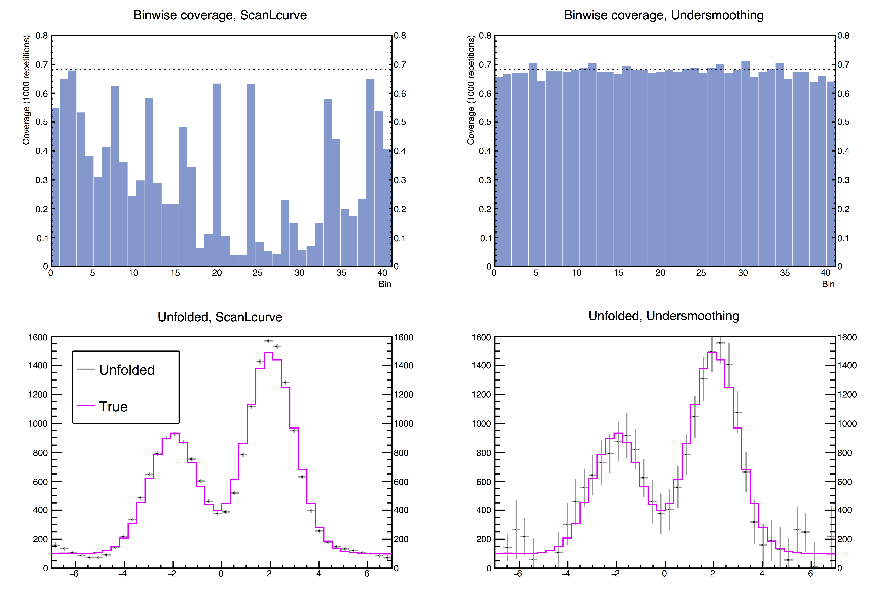

# Undersmoothed uncertainty quantification for unfolding    

This page provides an extension for the existing software [TUnfold](https://www.desy.de/~sschmitt/tunfold.html) written by Stefan Schmitt. The existing software provides several algorithms to unfold measured data from particle detectors to obtain the true physical spectra, but often suffers significant undercoverage with regards to uncertainty quantification. This extension provides another unfolding methodology, `DebiasTau`, which is a fully data-driven way of unfolding while meeting the desired coverage at the cost of slight increase in the interval lengths.

## Main functions

| Function | Input | Output | Description |
| --- | --- | --- | --- |
| DebiasTau | Initial Tau, Epsilon(tolerance), Max iteration | Debiased Tau | Debiases initial tau gradually until the minimum computed coverage meets the desired coverage, which is the nominal coverage subtracted by epsilon. |
| ComputeCoverage | Vector of estimation of the true distribution, Tau | Vector of computed coverage | Given a vector of estimation of the true distribution and a regularization strength parameter tau, computes the estimated coverage. |
| ComputeCoverageOracle | Vector of the true distribution, Tau | Vector of computed coverage | Same as `ComputeCoverage` but input is the true spectrum. Used to compare interval length. |

## Simulation

This simulation compares the coverage performances of the existing unfolding algorithm `ScanLcurve` provided by `TUnfold` and the algorithm `DebiasTau` provided by this extension. Top plots compare binwise coverages of each method, which are obtained by repeating unfolding 1,000 times with independent realizations of data with each algorithm. Bottom plots show one realization of unfolding of each method.

## Installation
The easiest way to make use of undersmoothed unfolding as of now is to replace the `TUnfold` sourcefile that comes with `ROOT` package. For the latest `ROOT` release, the `TUnfold` sourcefile is located at `root/hist/unfold/src` and the headerfile is located at `root/hist/unfold/inc`.

### Copyright (c) 2016-2017 Junhyung (Lyle) Kim and Mikael Kuusela
