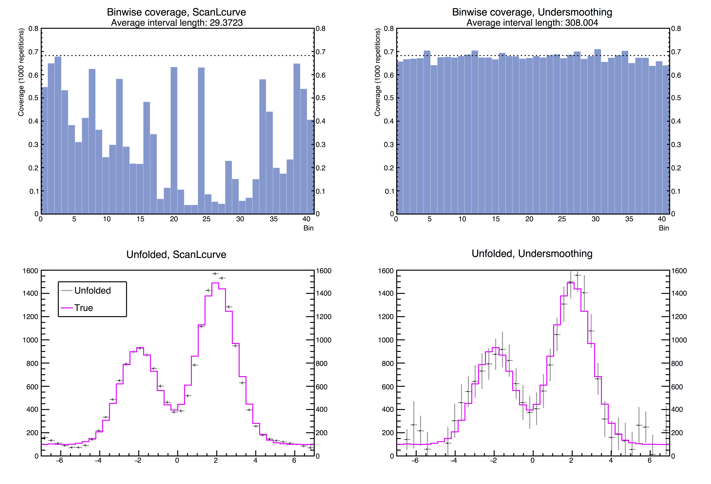

# Summary

The high energy physics unfolding problem [@Lyons2011; @Cowan1998; @Blobel2013; @Zech2016; Kuusela2016] is an ill-posed inverse problem arising in data analysis at the Large Hadron Collider (LHC) at CERN. Due to the limited resolution of particle detectors, any measurement made at the LHC is smeared, and the goal in unfolding is to make inferences about the true particle spectrum given the smeared observations.

Unfolding is a common task in experimental high-energy physics, and rigorous uncertainty quantification of the unfolded spectrum is of central importance to particle physicists. The standard approach is to form a regularized point estimator, and then to form frequentist confidence intervals using the variability of this estimator.

However, these confidence intervals derived from point estimates can seriously underestimate the true uncertainty since they ignore the bias that is used to regularize the problem [@Kuusela2015; @Kuusela2016; @Kuusela2017].

To address this issue, @Kuusela2016 proposed a data-driven technique for choosing the regularization strength so that the frequentist coverage of the unfolded uncertainties is improved to near-nominal level. Here we provide a software implementation of this method for `ROOT` [@root1997], the de facto data analysis framework used in high energy physics. Our implementation is based on extending `TUnfold` [tunfold2012], the existing unfolding library in ROOT, to include new functionality for unfolding with data-driven undersmoothing.

# Simulated example

`UndersmoothedUnfolding` is implemented so that it can be used with any initial estimate the regularization strength. We demonstrate the performance of `UndersmoothTau` in the case with two Gaussian peaks on top of a uniform background, resembling situations where invariant mass peaks are observed on top of some background events.

The simulation above compares the performance of the unfolded confidence intervals when the regularization strength is chosen using `ScanLcurve` provided by `TUnfold` and the algorithm `UndersmoothTau` provided by this software. The tolerance epsilon was set to 0.01, so the intervals from `UndersmoothTau` should have 67% coverage. The top plots compare the binwise coverage of the methods. The coverage is estimated by repeating the unfolding 1,000 times with independent realizations of data. The bottom plots show one realization of the unfolded confidence intervals for each method. The confidence intervals provided by `ScanLcurve` are too short and suffer from drastic undercoverage, while the intervals provided by `UndersmoothTau` have nearly nominal coverage without being excessively long.

Please refer to the [online documentation](https://jlylekim.github.io/UndersmoothedUnfolding/) for further details, which also
contains the test case with steeply falling spectra.

# References
