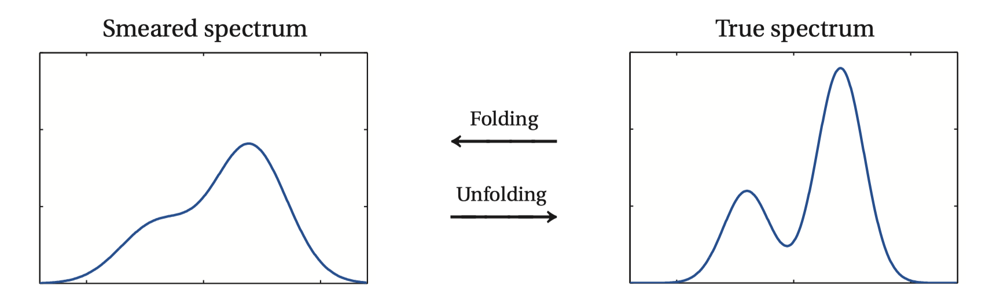

********
Overview
********

``UndersmoothedUnfolding`` is a software for unfolding in high energy physics with focus on
optimal *uncertainty quantification*. Most existing unfolding software only provide
methods for optimal point estimation; however, as as demonstrated in Kuusela (2016) [1]_,
confidence intervals formed from point estimates can suffer from significant undercoverage,
and thus might not be suitable for statistical inference and uncertainty quantification.

``UndersmoothedUnfolding`` is a ``ROOT`` [3]_ implementation of the data-driven
undersmoothing technique introduced in Kuusela (2016) [1]_, which aims at
choosing the regularization strength so that the resulting unfolded confidence intervals have
nearly nominal coverage.

It is extended from the existing unfolding library, ``TUnfold`` [2]_,
which is included in ``ROOT`` [3]_.

------------------
What is unfolding?
------------------

Any measurement made at the Large Hadron Collider (LHC) at CERN
is smeared by the finite resolution of the particle detectors. The goal in
unfolding is to use these smeared measurements to make non-parametric
inferences about the underlying particle spectrum.

.. [1] M. Kuusela, “Uncertainty quantification in unfolding elementary particle spectra at the Large Hadron Collider”, PhD thesis, EPFL (2016).
.. [2] S. Schmitt, “TUnfold, an algorithm for correcting migration effects in high energy physics”, Journal of Instrumentation **7** (2012).
.. [3] R. Brun and F. Rademakers, “ROOT - An Object Oriented Data Analysis Framework”, Nucl. Inst. & Meth. in Phys. Res. A **389** (1997).
