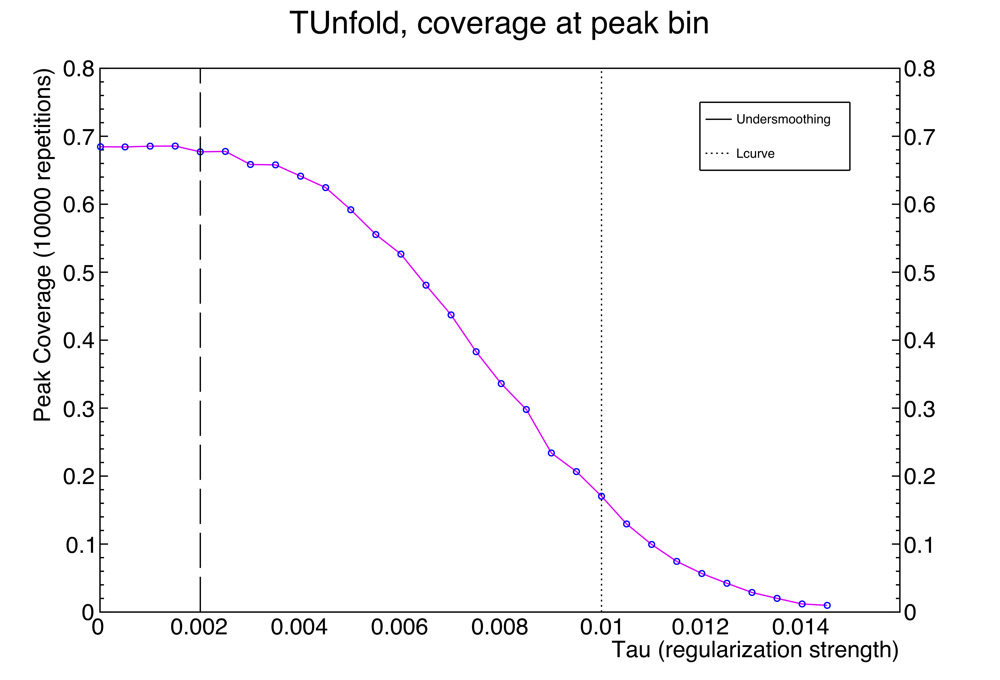
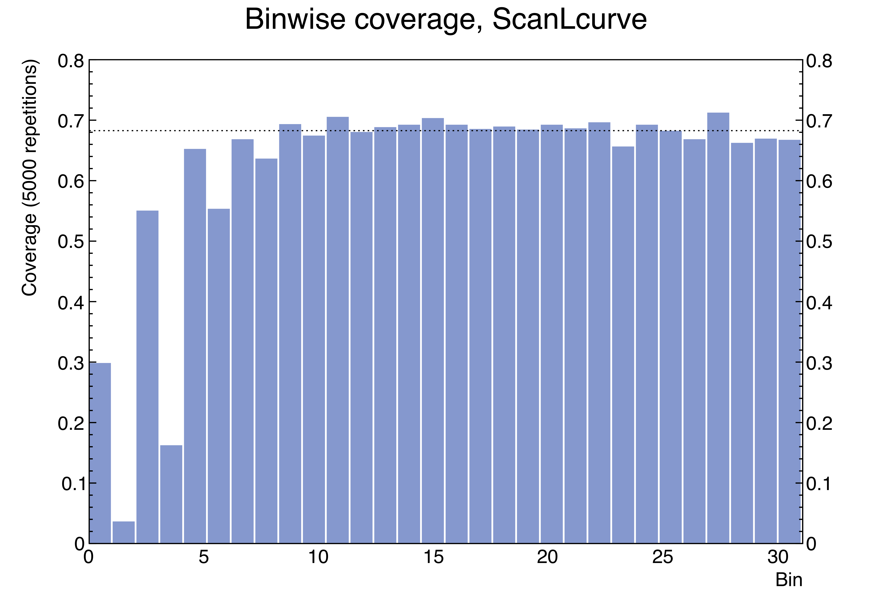
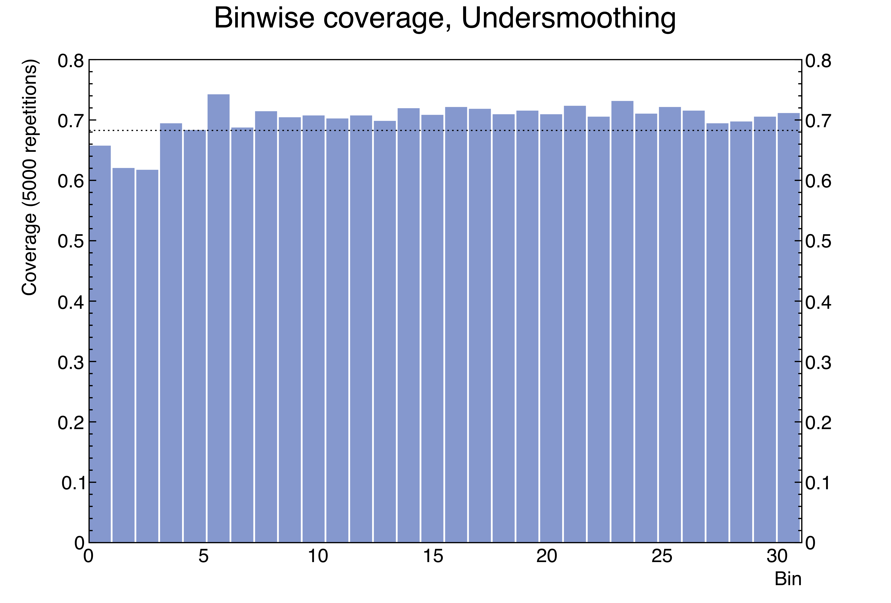

****************************
Why UndersmoothedUnfolding?
****************************

---------------------------------------------------------
Uncertainty quantification vs. point estimation
---------------------------------------------------------

``UndersmoothedUnfolding`` an extension for the unfolding software ``TUnfold`` V17.6 [2]_
written by Stefan Schmitt. ``TUnfold`` implements Tikhonov regularization for unfolding
smeared data from particle detectors.
However, as demonstrated by Kuusela (2016) [1]_, the resulting confidence intervals may seriously underestimate
the uncertainty in the unfolded space, unless care is taken in the choice of the regularization strength tau. MK: Can we do Latex for tau here?

MK: Explain the plot below

------------------
Two peaks spectra
------------------
.. image:: plots/undersmooth_demo_twopeaks.png
    :width: 100%
    :align: center

The simulation above compares the performance of the unfolded confidence
intervals when the regularization strength is chosen using `ScanLcurve`
provided by `TUnfold` and the algorithm `UndersmoothTau` provided by this
software. The tolerance epsilon was set to 0.01, so the intervals from
`UndersmoothTau` should have 67% coverage. The top plots compare the
binwise coverage of the methods. The coverage is estimated by repeating
the unfolding 1,000 times with independent realizations of data.
The bottom plots show one realization of the unfolded confidence intervals
for each method. The confidence intervals provided by `ScanLcurve` are too
short and suffer from drastic undercoverage, while the intervals provided
by `UndersmoothTau` have nearly nominal coverage without being excessively long.

------------------------
Steeply falling spectra
------------------------

**TODO: make similar plot to two peaks case**

.. [1] M. Kuusela, “Uncertainty quantification in unfolding elementary particle spectra at the Large Hadron Collider”, PhD thesis, EPFL (2016)
.. [2] S. Schmitt, “TUnfold, an algorithm for correcting migration effects in high energy physics”, Journal of Instrumentation **7** (2012).
